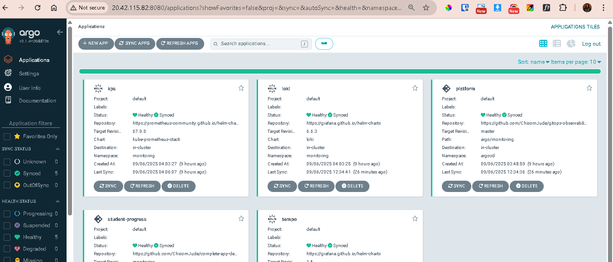

# GitOps Observability Setup (ArgoCD + Prometheus + Grafana + Loki + Tempo)



## Prequisites

We already worked on setting up our deployment App and ArgoCD [See App Repo]() 

This project provisions a full monitoring stack on a Kubernetes cluster using GitOps with ArgoCD. It includes:

- ArgoCD → GitOps control plane
- Kube-Prometheus-Stack → Prometheus, Alertmanager, Grafana
- Loki → Logs aggregation with Promtail
- Tempo → Distributed tracing
- Student Progress App → Sample FastAPI app instrumented with health checks & metrics

## Project Structure
```
gitops-observability/
└── argo/
    ├── root/
    │   └── app-of-apps.yaml        # Root Argo Application (App of Apps pattern)
    ├── monitoring/
    │   ├── kube-prometheus-stack.yaml # ArgoCD Application for kube-prometheus-stack
    │   ├── loki.yaml                  # ArgoCD Application for Loki
    │   ├── tempo.yaml                 # ArgoCD Application for Tempo
    │   └── grafana/
    │       └── datasources.yaml       # (Optional) Custom Grafana datasources (Loki, Tempo)
    └── optional/
        └── argocd-self-manage.yaml    # (Optional) Manage ArgoCD itself with Argo

```

## Deployment Flow

 - ArgoCD already set up into the argocd namespace:
 - Push to Github
 - Apply the Root Application (app-of-apps.yaml) to bootstrap the stack:

kubectl apply -f argo/root/app-of-apps.yaml -n argocd


ArgoCD will automatically sync:

- kube-prometheus-stack → Prometheus, Grafana, Alertmanager

- loki → Loki + Promtail

- tempo → Tempo

Verify:

`kubectl -n monitoring get pods`


## Accessing the UIs
ArgoCD UI : Port-forward ArgoCD to expose it on your host machine:

```
kubectl -n argocd port-forward svc/argo-cd-argocd-server 8080:80 --address 0.0.0.0
```

Access: `http://yourvmip:8080`

Login:

kubectl -n argocd get secret argocd-initial-admin-secret -o jsonpath="{.data.password}" | base64 -d; echo

Grafana UI

### Port-forward Grafana:

```
kubectl -n monitoring port-forward svc/kps-grafana 3000:80 --address 0.0.0.0
```

Access: `http://yourVMip:3000`

Login:

    - User: admin
     - Password:
```
kubectl -n monitoring get secret kps-grafana -o jsonpath="{.data.admin-password}" | base6
```